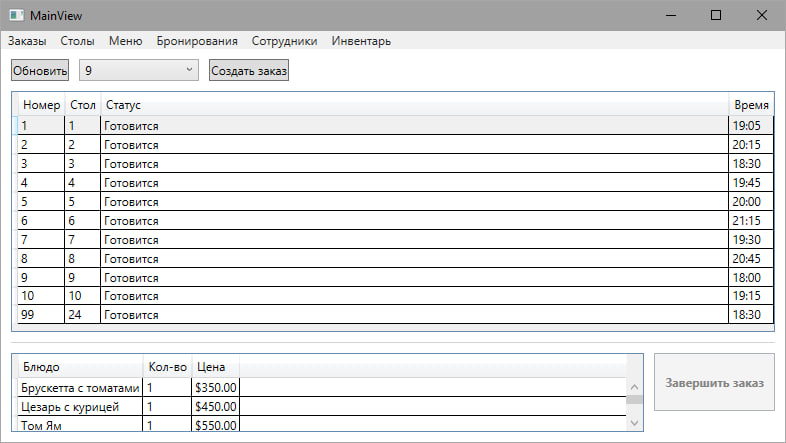
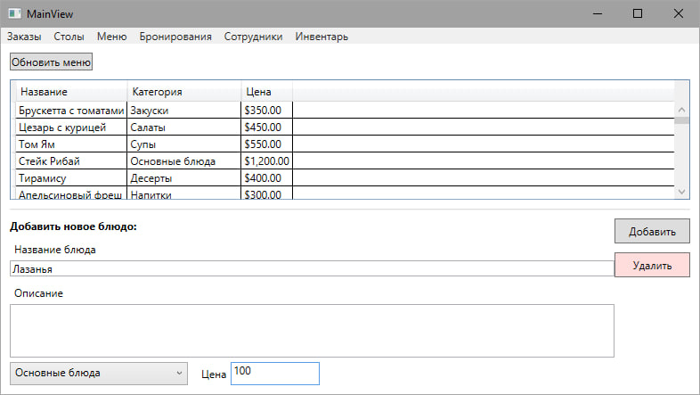
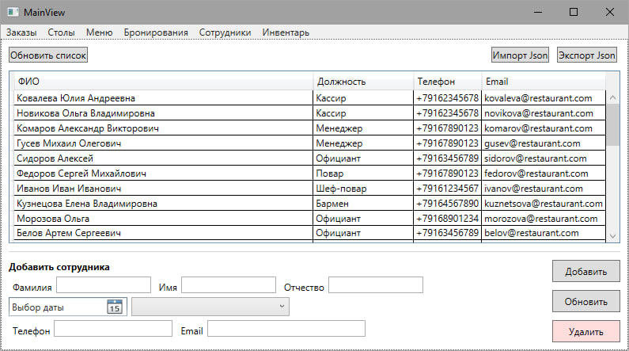
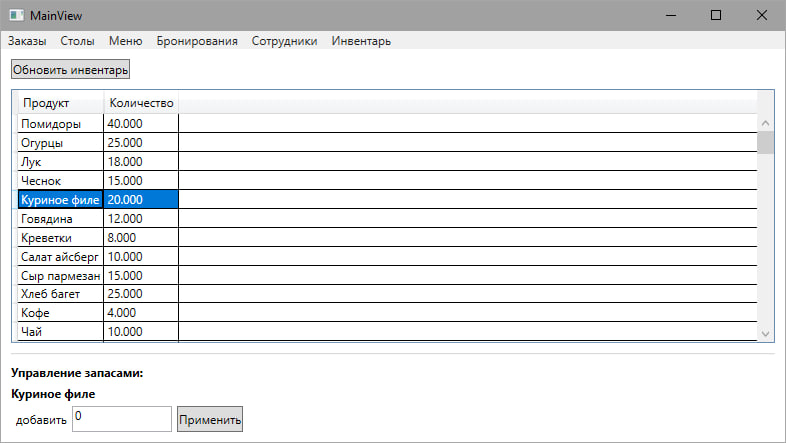

# Restaraunt-System

WPF-приложение для управления рестораном с использованием:
- **.NET 9**
- **Entity Framework Core**
- **PostgreSQL**
- **MVVM + Repository Pattern**

## Основные функции
- Управление столиками
- Оформление заказов
- Учет бронирований
- Управление сотрудниками
- Управление складом
- Управление меню

## Страницы приложения и их возможности

### Страница "Заказы"
- **Создание заказа** (выбор стола, блюд из меню)
- **Просмотр состава заказа** (список блюд, сумма)
- **Завершение заказа** (перевод статуса в "Выполнен")



### Страница "Столы"
- **Бронирование столиков** (выбор даты/времени)
- **Просмотр статусов** (свободен/занят/забронирован)


### Страница "Меню"
- Полный каталог блюд с категориями
- **Добавление нового блюда** (название, цена, категория)
- **Редактирование** позиций



### Страница "Сотрудники"
- Таблица всех сотрудников
- **CRUD операции**:
  - Добавление (`ФИО + должность + контакты`)
  - Редактирование данных
  - Деактивация сотрудников
- **Импорт/экспорт** в JSON



### Страница "Инвентарь"
- Текущие остатки продуктов
- Добавление продукта на склад



## Архитектура
```
├── RestarauntSystem.Core/ # Ядро системы
│ ├── Models/ # Сущности БД
│ ├── Repositories/ # Интерфейсы репозиториев
│ └── Services/ # Интерфейсы сервисов
│
├── RestarauntSystem.Infrastructure/ # Реализация
│ ├── Data/ # DbContext
│ ├── Services/ # Реализация сервисов
│ └── Repositories/ # Реализации репозиториев
│
└── RestarauntSystem.WPF/ # Отображение
  ├── Views/ # Окна приложения
  ├── ViewModels/ # Логика представлений
  └── Converters/ # Конвертеры для UI
```
