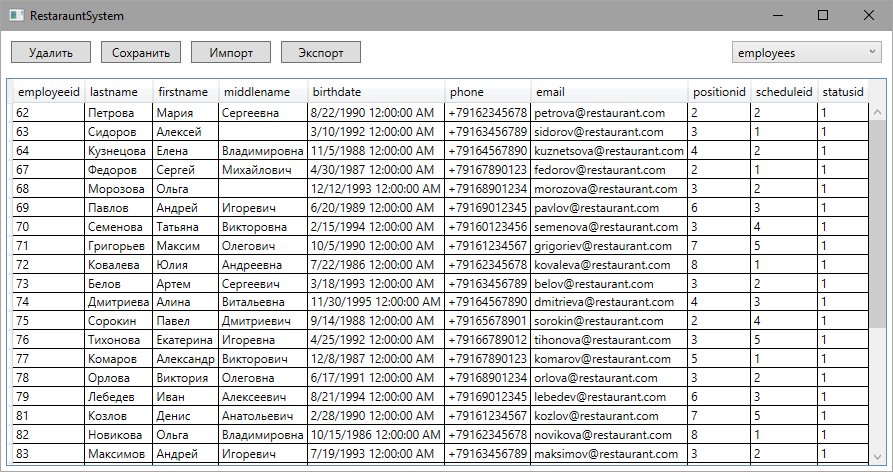

# Restaraunt-System

WPF-приложение для управления рестораном с использованием:
- **.NET 9**
- **Entity Framework Core**
- **PostgreSQL**
- **MVVM + Adapter pattern**

## Основные функции
- Управление столиками
- Оформление заказов
- Учет бронирований
- Управление сотрудниками
- Управление складом
- Управление меню
- Импорт/экспорт в JSON

  

## Архитектура
```
├── RestarauntSystem.Core
│ ├── Models/ # Сущности БД
│
├── RestarauntSystem.Infrastructure
│ ├── Data/ # DbContext
│ ├── Interfaces/ # Интерфейсы
│ └── Services/ # Реализация сервисов
│
└── RestarauntSystem.WPF
  ├── Views/ # Окна приложения
  └── ViewModels/ # Логика представлений
```
